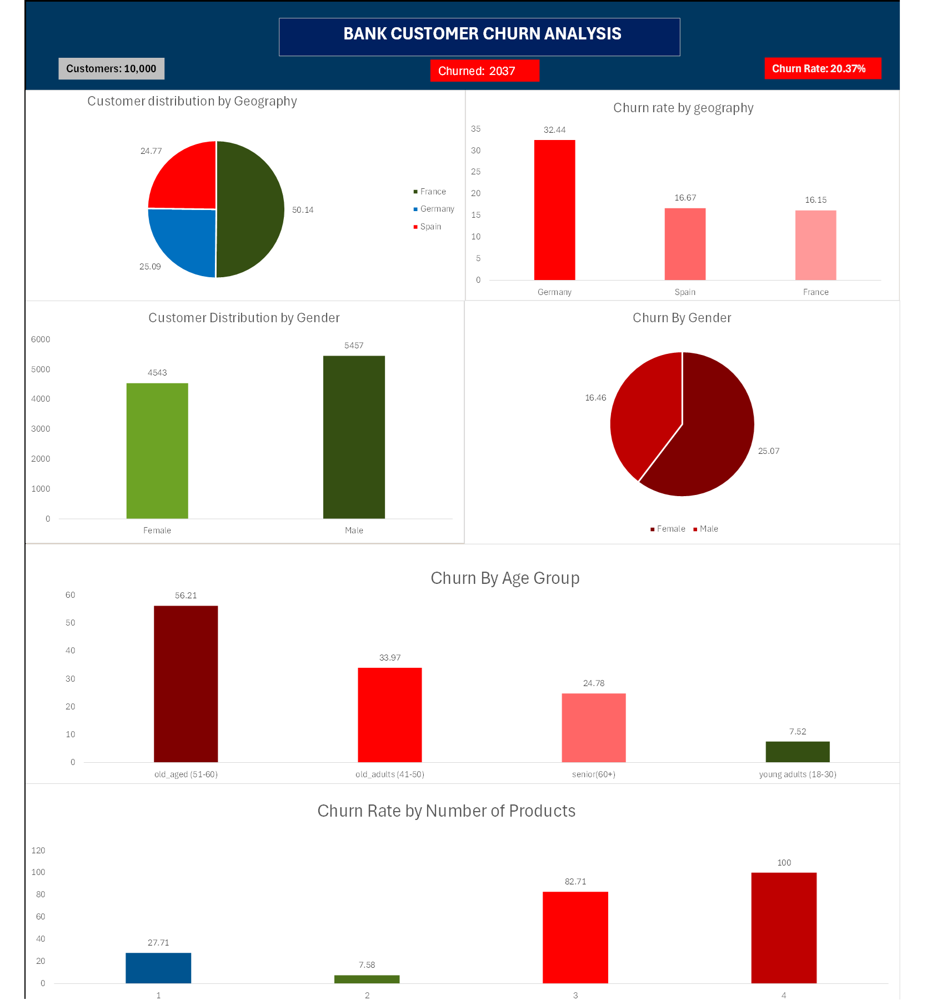

# Bank Customer Churn Analysis


> I analyzed 10,000 bank customers and found something that challenges everything banks believe about customer loyalty. 

---

## 💭 Story Behind This Project

From past 2 months i was learning and practicing SQL then i though of doing my first project by myself, then i downloaded a dataset from kaggle and wanted to 
find basic patterns about why are customers churning or leaving. Then i started doing this project from foundation to business insights to pattern finding. The 
most suprise finding for me was customers having 3 or 4 products = **100% churn rate**, then Germany was the country with highest churn double than other
country due to factors like old age(40+) and engagement. This was getting more interesting diving deep on this dataset. 


## The Problem

- **2,037 customers left** out of 10000 customers(20.37% churn rate) 
- Germany is losing customers at **double the rate** of France/Spain  
- Customers whose age over 40 = **70% of all churn**
- Nearly **half of the customers are inactive** and churning fast.

**The question:** Why are they leaving? And more importantly, can we stop it?

---

## What I Found 

### 1. The Multi-Product 

This was my most suprising moment when i found out:

- 1 product: 27.71% churn 
- 2 products: **7.6% churn** ← Sweet spot!
- 3 products: 82.71% churn 
- 4 products: **100% churn**

**What I think is happening:** Product complexity is creating confusion among customers, not loyalty. overwhelming customers with more products for more loyalty resulted in 
high churn rate.

**fix:** Having 2 product is a sweet spot. Cross-selling of more than 2 products should be stopped.

---

### 2. Germany churn rate double than other countries.

Germany: 32.44% churn rate
France: 16.15% churn rate
Spain: 16.67% churn rate 

**Why?** German customers are:

- Older: average age is 44yrs where for other countries its 39yrs.
- less engagement (42% active vs 55%)


**The fix:** Task force especially for germany market, focusing on age group above 40. 

---

### 3. Age

Churn by age:
- 18-30: 10% 
- 31-40: 16% 
- 41-50: **32%** 
- 51-60: **56%** 

People over 40 are only 37% of customers but **70% of churn**.

**The fix:** Age-specific retention is required but don't send the same email to a young customer and an old customer.

---

### 4. Inactive Member 

- 5,151 active members: 14% churn
- 4,849 inactive members: **27% churn**

**Translation:** Half the customers are inactive, and they're churning at nearly double the rate.

**The fix:** campaign with actual incentives which make them awake and active.

---

### 5. Other Patterns

- **female churn 8.6 points more than men**
- **36% of customers have zero balance** (data issue? dormant accounts? needs investigation)
- **Customers stabilize after 6-8 years** (more tenure years = loyal customers)

---

## How I Did This 

I did this project distributing in 3 parts from foundation to business insights and pattern finding.
I used SQL queries like:
- Basic SELECT, WHERE, GROUP BY
- SUM, AVG, COUNT aggregations
- Filtering and sorting
- CASE statements for segmentation
- CTEs
- Subqueries for comparisons
- Risk scoring algorithms
- Multi-step analysis with nested CTEs

**Total:** 25 queries

---

## My Favorite Query (The Risk Scorer)

This one ranks every customer by churn risk (0-10 scale):
```sql
WITH risk_calculation AS (
  SELECT 
    customerid, geography, age, balance, exited,
    (CASE WHEN age > 40 THEN 2 ELSE 0 END +
     CASE WHEN balance = 0 THEN 3 ELSE 0 END +
     CASE WHEN isactivemember = 0 THEN 2 ELSE 0 END +
     CASE WHEN numofproducts = 1 THEN 2 ELSE 0 END +
     CASE WHEN geography = 'Germany' THEN 1 ELSE 0 END) AS risk_score
  FROM churn_modelling
)
SELECT risk_score,
  COUNT(*) AS customer_count,
  SUM(exited) AS churned_customers,
  ROUND(SUM(exited)*100.0/COUNT(*), 2) AS churn_rate
FROM risk_calculation
GROUP BY risk_score
ORDER BY risk_score DESC;
```

**The validation:** Risk score 10 = 100% churn. Risk score 0 = 5% churn. 

---

## If I Was The Retention Manager I would:

- Stop cross-selling of 3 and 4 products which may help in saving customers.
- Run the risk query and identify 100 high risk customers and follow up them by calling or email.
- Send email or doing engaging programs with aim to reactivate inactive members.
- for germany launching a dedicated retention team and doing campaigns. 

**Expected result:** Churn drops from 20.37% → 15% (save 500-800 customers/year)

---

##  What's in This Repo
```
├── complete_analysis.sql    # All 25 queries with summary of each part.
└── README.md               
```

Coming soon:
- Detailed insights document
- Methodology (how I approached this)


---

## The suprise Moment
While doing this project especially multi product analysis, i was very suprose when customers with 3-4 products had 80-100% churn rate, i think my query was wrong and
rechecked it but query was right but my assumptions were. Then i realised that having many products wont help on building loyal customers. sometimes we have to limit 
what we offer in business.
This is why I love data analytics - it challenged me with what i *think* i know with what actually *is*.

---

## 💭 What I'd Do Differently

**Mistake #1:** I grouped by balance in my first revenue loss query and spent 2 hours debugging why my numbers were wrong.
then i found out that i don't need GROUP BY when calculating one total. Common mistake but big lesson learned.

**Mistake #2:** I almost gave up on the Germany analysis because the query was getting too complex. Then I discovered using CTEs and everything clicked. CTEs are now my favorite SQL feature.

**What worked:** Starting simple with foundation, then pattern finding, then business strategy. It helped me a lot from understanding data and finding business insights and pattern.

---

## Why I Built This

I'm learning data analytics and needed a portfolio project that actually meant something. Not just "I can write SQL" but "I can solve business problems and find patterns."

The revenue modeling and LTV calculations? Those are coming in Project #2 after I practice more. 

---

## What I Actually Learned

**Technical:**
- CTEs (my best friend)
- Risk scoring is just weighted CASE statements 

**Analytical:**
- Always question your assumptions like multi-product paradox
- Context is everything ("32% churn" means nothing without "2X the average")

**Business:**
- Not all insights are equally actionable (credit score doesn't matter, age does)
- Sometimes the best action is to STOP doing something (4-product bundles)

---

## Dashboard Visualization

Below is the Excel dashboard showcasing key insights from the bank customer churn analysis:



### Key Insights:
 Interactive dashboard featuring:
  - Geographic analysis (Germany crisis)
  - Age group breakdown (40+ spike)
  - Product paradox visualization
  - Gender and activity insights
---


Dataset source: [Kaggle Bank Churn](https://www.kaggle.com/datasets/shantanudhakadd/bank-customer-churn-prediction)

---

## Let's Connect

I'm looking for Junior Data Analyst roles where I can do this kind of work full-time, part time, remote.

If you:
- Need someone who can turn messy data into clear insights
- Want analysis that actually answers "so what should we DO?"
- Value honesty over false expertise

Let's talk.

E-mail: sarbeshacharya45@gmail.com


LinkedIn: https://www.linkedin.com/in/sarbesh-acharya-93a3251b4?utm_source=share&utm_campaign=share_via&utm_content=profile&utm_medium=ios_app


---

## Thank you so much 
**Dataset:** Kaggle community
**Mentor:** Alex the analyst


---

**⭐ Star this if you found it useful!**

Built by Sarbesh Acharya | December 2025

---

*P.S. If you spot any errors or have suggestions, that will be very helpful and spot my progress. This is my first project and I'm still learning.*
