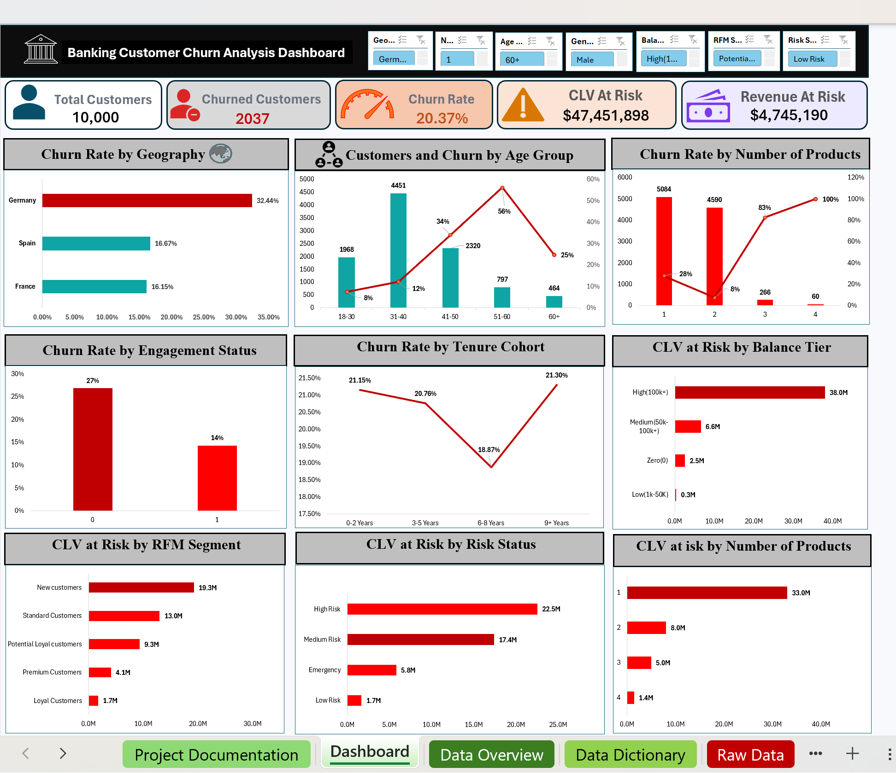
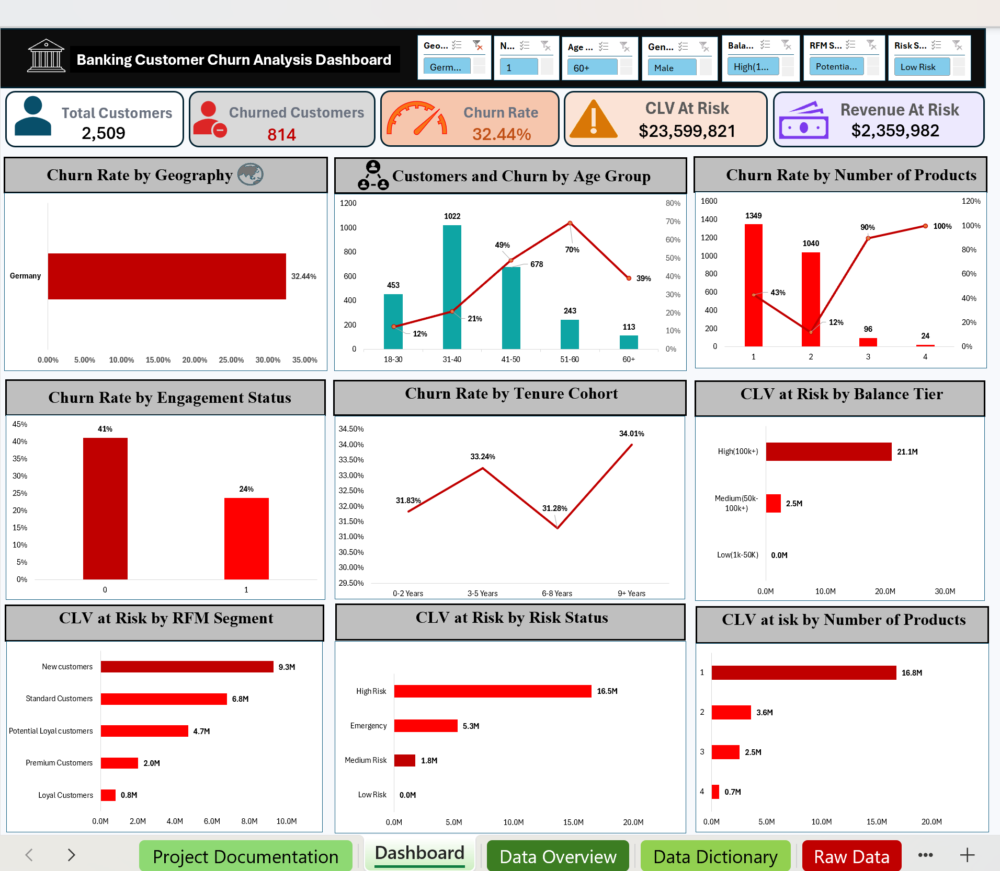
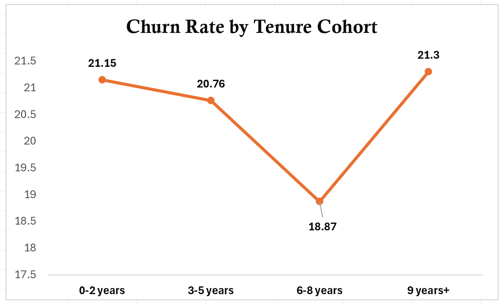

# Banking Customer Churn Analysis & Retention Strategy
## End-to-End SQL + Excel Dashboard Project


This project analyzes customer churn in a banking dataset using **SQL and Microsoft Excel**.  
The goal is to identify high-risk customer groups, understand churn behavior, measure financial exposure through **CLV at Risk** and **Revenue at Risk**, and provide business recommendations for customer retention.

The project started as a SQL-based churn analysis and was later extended into a complete **interactive Excel dashboard** with KPI cards, slicers, pivot charts, RFM segmentation, risk scoring, and business recommendations.

---

## Project Overview

Customer churn is a major business problem for banks because losing customers directly affects revenue, future customer value, and long-term business growth.

This project answers questions such as:

- Which customer groups are more likely to churn?
- Which geography has the highest churn rate?
- Which age groups show stronger churn behavior?
- How does product count affect churn?
- Which customers carry the highest CLV at Risk?
- Which segments should the bank prioritize for retention?
- How can RFM and risk scoring support business decisions?

---

## Dataset Overview

The dataset contains information about **10,000 banking customers**.

The main target variable is:

| Column | Meaning |
|---|---|
| `Exited` | 1 = Customer churned, 0 = Customer retained |

Main fields used in the analysis:

- CustomerId
- CreditScore
- Geography
- Gender
- Age
- Tenure
- Balance
- NumOfProducts
- HasCrCard
- IsActiveMember
- EstimatedSalary
- Exited

---

## Tools Used

- SQL
- Microsoft Excel
- Pivot Tables
- Pivot Charts
- Excel Formulas
- Slicers
- KPI Cards
- RFM Segmentation
- CLV at Risk Analysis
- Revenue at Risk Analysis
- Risk Scoring
- Dashboard Design

---

## Project Workflow

1. Performed SQL analysis to explore customer churn patterns.
2. Created churn, cohort, RFM, CLV, and risk-scoring queries.
3. Loaded raw and SQL-supported data into Excel.
4. Cleaned and transformed the dataset.
5. Created calculated fields such as:
   - Churn Status
   - Age Group
   - Balance Tier
   - Tenure Cohort
   - Revenue Value
   - CLV Estimate
   - CLV at Risk
   - Revenue at Risk
   - Risk Score
   - Risk Status
   - RFM Segment
6. Built pivot tables and pivot charts for churn and financial risk analysis.
7. Created a dashboard source sheet for interactivity.
8. Connected slicers to KPI cards and dashboard charts.
9. Built an interactive Excel dashboard.
10. Summarized key insights and business recommendations.

---

## SQL Analysis Performed

The SQL phase focused on customer churn exploration and advanced segmentation.

Main SQL analysis areas included:

- Overall churn summary
- Churn by geography
- Churn by gender
- Churn by age group
- Churn by product count
- Churn by credit card status
- Churn by active/inactive customers
- Balance tier analysis
- Tenure cohort analysis
- RFM segmentation
- CLV and revenue impact analysis
- Risk scoring and risk status classification
- Business recommendations based on churn behavior

---

## Excel Dashboard Update

I extended this SQL Banking Churn Analysis project into a complete interactive Excel dashboard.

The Excel dashboard includes:

- Interactive KPI cards
- Slicers for Geography, Gender, Age Group, Risk Status, Product Count, Balance Tier, and RFM Segment
- Churn Rate analysis by Geography, Age Group, Product Count, Engagement Status, and Tenure Cohort
- CLV at Risk analysis by Balance Tier, Risk Status, RFM Segment, and Product Count
- RFM segmentation analysis
- Risk Status analysis
- Business recommendations for customer retention

---

## Dashboard Preview



---

## Germany Filter View

Germany was identified as a high-risk geography with higher churn and strong CLV/Revenue exposure.  
The dashboard slicer allows users to filter Germany and observe changes in KPI cards, churn rate, CLV at Risk, and Revenue at Risk.



---

## Favorite Query / Analysis View

This view highlights one of the key analytical outputs from the project.



---

## Excel Workbook

The full interactive Excel dashboard is available here:

[Download Excel Dashboard](excel_dashboard/Banking_Customer_Churn_SQL_Excel_Dashboard.xlsx)

---

## Project Documentation

Detailed project documentation is available here:

[View Project Documentation](docs/project_documentation.md)

---

## Key Dashboard Metrics

| KPI | Value |
|---|---:|
| Total Customers | 10,000 |
| Churned Customers | 2,037 |
| Retained Customers | 7,963 |
| Churn Rate | 20.37% |
| CLV at Risk | 47,451,898 |
| Revenue at Risk | 4,745,190 |

---

## Key Findings

### 1. Germany has the highest churn risk

Geography analysis showed that Germany has a higher churn rate compared to other countries.  
This makes Germany an important segment for customer retention campaigns.

### 2. Older customers show higher churn tendency

Age group analysis showed stronger churn behavior among older customer groups.  
This suggests the bank may need better support, loyalty offers, or personalized services for older customers.

### 3. Product count affects churn behavior

Product analysis showed that churn behavior varies based on the number of products used by customers.  
This helps identify customers who may need better product experience, cross-sell offers, or retention support.

### 4. Disengaged customers are more likely to churn

Engagement analysis showed that inactive or disengaged customers have stronger churn risk.  
This highlights the need for reactivation campaigns.

### 5. High-balance customers create high financial exposure

Balance tier analysis showed that high-balance customers contribute heavily to CLV at Risk.  
Even if churn rate is not always the highest in this group, the financial impact is significant.

### 6. Risk Status helps prioritize retention

Risk scoring and risk status classification help separate customers into Low, Medium, High, and Emergency risk groups.  
This allows the bank to prioritize retention efforts more effectively.

### 7. RFM segmentation supports advanced customer targeting

RFM segmentation helps identify valuable and at-risk customer groups.  
This can support targeted retention, loyalty programs, and personalized offers.

---

## Business Recommendations

| Key Issue | Recommended Action |
|---|---|
| High churn in Germany | Launch geography-specific retention campaigns |
| Older customers showing higher churn | Provide senior-friendly support and loyalty benefits |
| Disengaged customers churn more | Run reactivation campaigns |
| High CLV at Risk among high-balance customers | Prioritize high-value customer retention |
| Product-based churn patterns | Improve product experience and apply careful cross-selling |
| High Risk and Emergency Risk customers | Focus retention budget on high-value risky customers |
| RFM high-risk segments | Create segment-specific offers and loyalty strategies |

---

## Excel Workbook Structure

The Excel workbook includes the following sheets:

| Sheet | Purpose |
|---|---|
| Project Documentation | Explains project objective, workflow, findings, limitations, and recommendations |
| Dashboard | Final interactive dashboard |
| Data Overview | Summary KPIs and high-level dataset metrics |
| Data Dictionary | Description of raw and calculated fields |
| Raw Data | Original dataset |
| Clean Data | Cleaned and transformed analysis-ready dataset |
| RFM Analysis | Customer-level RFM segmentation data |
| Dashboard Source | Backend pivot tables used for dashboard interactivity |
| Geographic Analysis | Churn and CLV analysis by geography |
| Gender Analysis | Churn analysis by gender |
| Age Group Analysis | Churn and CLV analysis by age group |
| Product Analysis | Churn and CLV analysis by product count |
| Credit Card Analysis | Churn analysis by credit card status |
| Engagement Analysis | Churn and CLV analysis by customer engagement |
| Balance Tier Analysis | Churn and CLV analysis by balance tier |
| Tenure Cohort Analysis | Churn analysis by customer tenure group |
| Risk Score Analysis | Churn analysis by risk score |
| Risk Status Analysis | CLV and churn analysis by risk category |
| RFM Segment Analysis | CLV and churn analysis by RFM segment |

---

## Project Structure

```text
SQL-Banking-Churn-Analysis/
│
├── SQL_Queries/
│   └── complete_analysis.sql
│
├── data/
│   └── banking_churn_dataset.csv
│
├── excel_dashboard/
│   └── Banking_Customer_Churn_SQL_Excel_Dashboard.xlsx
│
├── images/
│   ├── dashboard_overview.png
│   ├── dashboard_germany_filter.png
│   └── favorite_query_view.png
│
├── docs/
│   └── project_documentation.md
│
└── README.md
```

---

## Deliverables

- Complete SQL analysis script
- Cleaned Excel workbook
- Interactive Excel dashboard
- Dashboard screenshots
- Germany filter view
- Favorite query / analysis screenshot
- RFM segmentation
- CLV at Risk and Revenue at Risk analysis
- Risk scoring and Risk Status segmentation
- Business recommendations

---

## Limitations

This project uses a sample banking churn dataset.  
Some business values such as Revenue Value, CLV Estimate, Revenue at Risk, and CLV at Risk are estimated for analytical and portfolio demonstration purposes.

The dataset does not include:

- Transaction history
- Actual bank revenue records
- Customer complaint history
- Marketing campaign data
- Customer service interaction records
- Branch-level service data
- Real customer contact history
- Transaction dates

Because transaction-level dates are not available, the RFM segmentation uses available proxy variables such as:

- Tenure
- Number of Products
- Balance
- Estimated Salary

Therefore, the results should be interpreted as an analytical simulation and portfolio project rather than a final production-level banking model.

---

## Skills Demonstrated

This project demonstrates skills in:

- SQL analysis
- Excel data cleaning
- Data transformation
- Pivot tables
- Pivot charts
- Interactive dashboard design
- Slicer-based filtering
- KPI card creation
- CLV at Risk analysis
- Revenue at Risk analysis
- RFM segmentation
- Risk scoring
- Business insight generation
- Business recommendation writing
- GitHub project documentation

---

## Conclusion

This project demonstrates how SQL and Microsoft Excel can be used together to perform customer churn analysis for a banking business.

The final dashboard highlights customer churn patterns, CLV at Risk, Revenue at Risk, risk segmentation, RFM segmentation, and business recommendations for customer retention.

Overall, this project helps identify which customer groups are more likely to churn, which segments create the highest financial risk, and where the bank should prioritize retention efforts.

---

## Author

**Sarbesh Acharya**  
Aspiring Data Analyst  
GitHub: [Sarbeshacharya](https://github.com/Sarbeshacharya)  
LinkedIn: [Sarbesh Acharya](https://www.linkedin.com/in/sarbesh-acharya-93a3251b4/)
